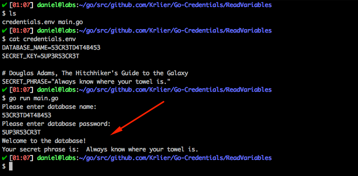

# Go-Credentials

 > This is a simple project to demonstrate how to remove credentials and sensitive information from your code using GoLang. 

    

## What is this project about?

This is the project that was used to create the tutorial on how to remove Hard-Coded Credentials from code in GoLang.

You can find the tutorial on Medium by clicking [here].

[here]:https://medium.com/@daniel.carlier/how-to-remove-hard-coded-credentials-from-code-in-golang-2212dc04b841